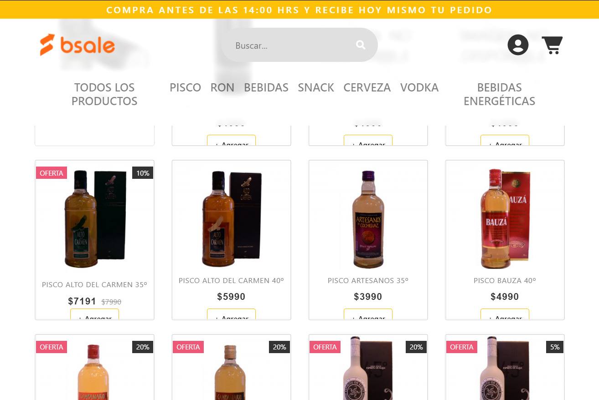

## Ejercicio

Ejercicio Construir una tienda online que despliegue productos agrupados por la categoría a la que pertenecen, generando por separado backend (API REST) y frontend (aplicación que la consuma).

Además, hay que agregar un buscador, el cual tiene que estar implementado a nivel de servidor, mediante una Api Rest cuyo lenguaje y framework puede ser de libre elección. Es decir, los datos de productos deben llegar filtrados al cliente.

### BACK

Paquetes utilizados:

- Express
- MySql
- Cors

El servidor disponibiliza las siguientes rutas:

- /Api/Products/ GET: Retorna todos los productos.
- /Api/Products/Category/:category GET: Recibe por parámetro un string y retorna los productos de dicha categoría
- /Api/Products/Search/:products GET: recibe por parámetro un string y retorna los productos y/o categorías que contenga el string.

<!-- * La consulta a la base de datos por medio de la ruta /Api/Products/Search/:products se hace a través de ?, y no con parámetros en texto plano con el objetivo para evitar los ataques de tipo SQL injection a nuestra base de datos. -->

### FRONT

Recursos externos utilizados:

- Bootstrap
- JQuery
- Font Awesome

  1.- Al acceder al front, una vez construido el DOM se dispara el evento DOMContentLoaded para cargar las primeras funciones del main.js
  2.- Utiliza API Fetch para el envío de la request del usuario.
  3.- Para escuchar el evento de agregar productos al carrito después de crear el documento utilizamos el Event Delegation (delegación de eventos).

### Deploy: https://bsale-store-test.herokuapp.com/

<h1 align="center">
   
</h1>
